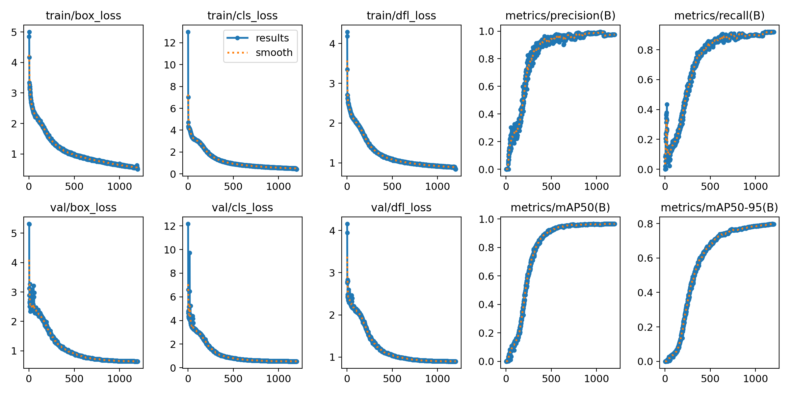

# SLAT-YOLO

[English](README.md) | [简体中文](README.zh-CN.md)

SLAT-YOLO 是面向轨道板裂缝的 YOLO11 目标检测方法，通过注意力增强、特征细化、轻量化融合与上下文重标定改善裂缝特征表达。
本项目基于 Ultralytics 8.4.143，提供模型源码、YAML 配置、训练脚本、实验曲线，以及基线与消融模型权重。

对应论文：**SLAT-YOLO: Shape-aware attention and spatially enhanced token refinement for robust track slab crack detection**。

## 方法模块

| 模块 | 作用 | 代码实现 |
| --- | --- | --- |
| C3k2-CA | 在主干特征中引入坐标注意力，保留方向与位置信息。 | [C3k2](ultralytics/nn/modules/block.py)、[CA](ultralytics/nn/extra_modules/attention.py) |
| C2-STR | 结合 token 统计注意力、Dynamic Tanh、Mona 适配与门控前馈处理，细化特征表达。 | [transformer.py](ultralytics/nn/extra_modules/transformer.py) |
| VoV-GSCSP / GSConv | 在颈部结合轻量卷积与跨阶段特征融合。 | [block.py](ultralytics/nn/extra_modules/block.py) |
| MPCR-Head | 利用多种补丁尺度的上下文，重标定回归与分类分支特征。 | [head.py](ultralytics/nn/extra_modules/head.py) |
| Wise-ShapeIoU | 结合形状相关的边界框回归与自适应损失加权。 | [slat_loss.py](ultralytics/utils/slat_loss.py) |

模型及消融配置位于 [my_project/yaml](my_project/yaml)，默认模型入口为
[slat-yolo.yaml](my_project/yaml/slat-yolo.yaml)。

## 安装与训练

使用 Python 3.10 及以上版本，并安装适合本机 CPU/CUDA 环境的 PyTorch。

```bash
git clone https://github.com/cjdfree/SLAT-YOLO.git
cd SLAT-YOLO
pip install -e .
```

本研究数据集不公开。请通过 `--data` 指定您自己的 YOLO 数据配置文件。

```bash
python -m my_project.run train --data /path/to/your/data.yaml --device 0 --imgsz 1024

# YOLO11n baseline
python -m my_project.run train --model my_project/yaml/yolo11n.yaml --data /path/to/your/data.yaml --device 0 --name baseline
```

[训练脚本](my_project/run.py) 使用以下项目默认参数，未指定的选项沿用 Ultralytics 默认值。
图像输入尺寸为 **1024**，训练输出保存在 `my_project/outputs/`。

| 参数 | 默认值 |
| --- | --- |
| `imgsz` | **1024** |
| `epochs` / `batch` | 1200 / 16 |
| `optimizer` / `lr0` / `lrf` | auto / 0.01 / 0.01 |
| `momentum` / `weight_decay` | 0.937 / 0.0005 |
| `pretrained` / `amp` | False / False |
| `seed` / `deterministic` | 0 / True |
| `patience` / `workers` | 0 / 4 |

## 实验结果

下表数值以百分比表示，选取各次训练 CSV 中验证 AP50 最高的轮次，Precision、Recall 和 AP50–95 均取自同一轮。
历史划分中训练与验证存在同源增强图像重叠，因此这些数值仅反映该实验设置，不代表独立测试集性能。

### 消融实验

各行表示在 YOLO11n 上增加的模块，SLAT-YOLO 表示完整配置。

| 配置 | Precision (%) | Recall (%) | AP50 (%) | AP50–95 (%) |
| --- | ---: | ---: | ---: | ---: |
| [C2-STR](my_project/results/ablation/yolo11n-C2-STR) | 94.31 | 88.09 | 93.78 | 68.48 |
| [C3k2-CA](my_project/results/ablation/yolo11n-C3k2-CA) | 95.06 | 83.62 | 92.81 | 72.93 |
| [C3k2-CA-C2-STR](my_project/results/ablation/yolo11n-C3k2-CA-C2-STR) | 97.17 | 85.11 | 94.71 | 69.50 |
| [C3k2-CA-C2-STR-VoV-GSCSP](my_project/results/ablation/yolo11n-C3k2-CA-C2-STR-VoV-GSCSP) | 95.03 | 89.58 | 95.75 | 78.69 |
| [C3k2-CA-C2-STR-VoV-GSCSP-MPCR-Head](my_project/results/ablation/yolo11n-C3k2-CA-C2-STR-VoV-GSCSP-MPCR-Head) | 96.79 | 89.57 | 96.10 | 78.12 |
| [SLAT-YOLO](my_project/results/ablation/slat-yolo) | 97.52 | 91.98 | 96.62 | 79.62 |
| [C3k2-CA-MPCR-Head](my_project/results/ablation/yolo11n-C3k2-CA-MPCR-Head) | 95.69 | 87.45 | 94.47 | 73.95 |
| [C3k2-CA-VoV-GSCSP](my_project/results/ablation/yolo11n-C3k2-CA-VoV-GSCSP) | 95.21 | 89.79 | 95.38 | 71.43 |
| [C3k2-CA-VoV-GSCSP-MPCR-Head](my_project/results/ablation/yolo11n-C3k2-CA-VoV-GSCSP-MPCR-Head) | 94.25 | 91.70 | 96.87 | 79.25 |
| [C3k2-CA-VoV-GSCSP-MPCR-Head-CIoU](my_project/results/ablation/yolo11n-C3k2-CA-VoV-GSCSP-MPCR-Head-CIoU) | 97.50 | 91.28 | 95.84 | 77.74 |
| [C3k2-CA-VoV-GSCSP-MPCR-Head-GIoU](my_project/results/ablation/yolo11n-C3k2-CA-VoV-GSCSP-MPCR-Head-GIoU) | 95.45 | 91.28 | 95.93 | 80.36 |
| [C3k2-CA-VoV-GSCSP-MPCR-Head-SIoU](my_project/results/ablation/yolo11n-C3k2-CA-VoV-GSCSP-MPCR-Head-SIoU) | 95.44 | 88.99 | 95.52 | 73.93 |
| [C3k2-CA-VoV-GSCSP-MPCR-Head-Wise-ShapeIoU](my_project/results/ablation/yolo11n-C3k2-CA-VoV-GSCSP-MPCR-Head-Wise-ShapeIoU) | 94.35 | 92.55 | 96.14 | 78.36 |
| [MPCR-Head](my_project/results/ablation/yolo11n-MPCR-Head) | 95.83 | 81.70 | 91.87 | 69.48 |
| [VoV-GSCSP](my_project/results/ablation/yolo11n-VoV-GSCSP) | 89.74 | 84.68 | 91.79 | 67.02 |
| [VoV-GSCSP-MPCR-Head](my_project/results/ablation/yolo11n-VoV-GSCSP-MPCR-Head) | 94.84 | 87.66 | 94.15 | 73.66 |
| [Wise-ShapeIoU](my_project/results/ablation/yolo11n-Wise-ShapeIoU) | 92.77 | 86.81 | 93.42 | 72.50 |

### 损失函数对比

| 配置 | Precision (%) | Recall (%) | AP50 (%) | AP50–95 (%) |
| --- | ---: | ---: | ---: | ---: |
| [CIoU](my_project/results/loss/yolo11n-CIoU) | 94.04 | 82.13 | 90.26 | 69.53 |
| [DIoU](my_project/results/loss/yolo11n-DIoU) | 94.21 | 72.69 | 85.50 | 61.60 |
| [EIoU](my_project/results/loss/yolo11n-EIoU) | 94.59 | 81.78 | 89.43 | 64.98 |
| [GIoU](my_project/results/loss/yolo11n-GIoU) | 93.87 | 79.36 | 86.71 | 66.72 |
| [Inner-CIoU](my_project/results/loss/yolo11n-Inner-CIoU) | 93.73 | 85.11 | 90.46 | 69.74 |
| [Inner-PIoU](my_project/results/loss/yolo11n-Inner-PIoU) | 95.57 | 82.13 | 90.74 | 69.52 |
| [Inner-ShapeIoU](my_project/results/loss/yolo11n-Inner-ShapeIoU) | 91.23 | 75.96 | 85.03 | 62.70 |
| [PIoU](my_project/results/loss/yolo11n-PIoU) | 94.42 | 84.89 | 92.23 | 69.51 |
| [ShapeIoU](my_project/results/loss/yolo11n-ShapeIoU) | 92.39 | 84.47 | 90.76 | 64.66 |
| [SIoU](my_project/results/loss/yolo11n-SIoU) | 95.04 | 81.55 | 90.52 | 70.33 |
| [Wise-CIoU](my_project/results/loss/yolo11n-Wise-CIoU) | 94.07 | 85.32 | 92.00 | 69.63 |
| [Wise-Inner-MPDIoU-v3](my_project/results/loss/yolo11n-Wise-Inner-MPDIoU-v3) | 93.81 | 85.11 | 91.52 | 70.90 |
| [Wise-ShapeIoU](my_project/results/loss/yolo11n-Wise-ShapeIoU) | 92.77 | 86.81 | 93.42 | 72.50 |
| [Wise-WIoU](my_project/results/loss/yolo11n-Wise-WIoU) | 93.77 | 83.83 | 92.16 | 70.29 |

### 注意力机制对比

| 配置 | Precision (%) | Recall (%) | AP50 (%) | AP50–95 (%) |
| --- | ---: | ---: | ---: | ---: |
| [C3k2-CA](my_project/results/attention/yolo11n-C3k2-CA) | 95.06 | 83.62 | 92.81 | 72.93 |
| [CBAM](my_project/results/attention/yolo11n-CBAM) | 95.03 | 81.39 | 91.02 | 67.10 |
| [EMA](my_project/results/attention/yolo11n-EMA) | 93.54 | 78.51 | 88.97 | 61.67 |
| [SEAttention](my_project/results/attention/yolo11n-SEAttention) | 92.90 | 83.47 | 91.50 | 71.59 |

### 目标检测模型对比

| 配置 | Precision (%) | Recall (%) | AP50 (%) | AP50–95 (%) |
| --- | ---: | ---: | ---: | ---: |
| [RT-DETR-L](my_project/results/comparison/rtdetr-l) | 95.05 | 75.53 | 82.93 | 54.83 |
| [YOLO11n](my_project/results/comparison/yolo11n) | 96.98 | 82.12 | 91.30 | 70.02 |
| [YOLO12n](my_project/results/comparison/yolo12n) | 98.56 | 80.00 | 89.94 | 68.44 |
| [YOLO13n](my_project/results/comparison/yolo13n) | 94.96 | 83.40 | 90.12 | 71.35 |
| [YOLOv10n](my_project/results/comparison/yolov10n) | 90.38 | 79.95 | 89.51 | 59.56 |
| [YOLOv5n](my_project/results/comparison/yolov5n) | 93.74 | 73.40 | 82.04 | 61.88 |
| [YOLOv8n](my_project/results/comparison/yolov8n) | 95.31 | 82.12 | 89.75 | 69.46 |
| [YOLOv9t](my_project/results/comparison/yolov9t) | 85.99 | 73.15 | 79.91 | 51.18 |

各模型训练时长不同：YOLOv5n 记录了 2500 轮、RT-DETR-L 记录了 515 轮，其余模型对比记录了 1200 轮。
点击表中名称可查看对应训练日志与曲线；完整汇总见
[ablation_summary.csv](my_project/results/ablation_summary.csv) 和
[comparison_summary.csv](my_project/results/comparison_summary.csv)。结果目录不包含图像预览及标注。



## 权重与预测

下载脚本提供 17 个基线及消融模型的推理权重。完整模型的最终实验保留了训练日志，但没有可发布的对应权重。
以下示例使用尚未加入最终 Wise-ShapeIoU 阶段的架构消融权重。

```bash
python -m my_project.download_assets checkpoints
python -m my_project.run predict --model my_project/checkpoints/yolo11n-C3k2-CA-C2-STR-VoV-GSCSP-MPCR-Head.pt --source /path/to/images --device 0 --imgsz 1024
```

## 许可与致谢

本项目使用 [AGPL-3.0](LICENSE) 许可，引用信息见 [CITATION.cff](CITATION.cff)。
相关模块整理自作者的实验工程，并基于以下项目的工作：

[Ultralytics](https://github.com/ultralytics/ultralytics),
[Coordinate Attention](https://github.com/Andrew-Qibin/CoordAttention),
[ToST](https://github.com/RobinWu218/ToST), [Mona](https://github.com/Leiyi-Hu/mona),
[GSConv](https://github.com/AlanLi1997/slim-neck-by-gsconv),
[SEAM / MultiSEAM](https://github.com/Krasjet-Yu/YOLO-FaceV2).

第三方原始许可保留在 [docs/upstream/licenses](docs/upstream/licenses)。SLAT-YOLO 为研究项目，并非 Ultralytics 官方产品。
